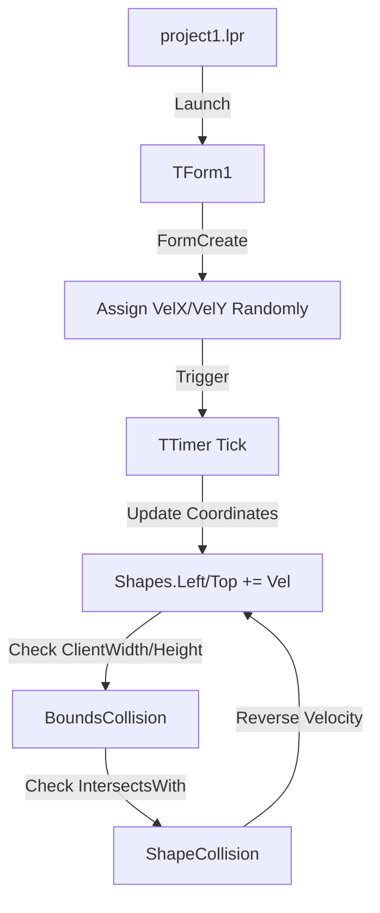

# Developer & Technical Documentation

This document provides a technical guide to the **P-animation** application's architecture and execution.

---

## System Architecture

The application is a standard Lazarus event-driven form application utilizing the `ExtCtrls` and `Graphics` packages.



---

## Directory Structure & File Roles

```
.
├── project1.lpi / .lpr / .lps # Lazarus Project Information and entry points
├── unit1.pas                  # The main Delphi/Pascal source code governing behavior
├── unit1.lfm                  # The Lazarus Form layout file
├── lib/                       # Compiled object and unit files
├── README.md                  # General overview
└── Documentation.md           # Technical documentation
```

---

## Workflow

The execution flow of P-animation:
1. **Initialization**: On `FormCreate`, an array of `Shapes[0..5]` is populated with `Shape1` through `Shape6`. `Randomize` is called and `VelX`/`VelY` are seeded with values between 1 and 5.
2. **Action Trigger**: The `Timer1Timer` ticks continuously based on the design-time interval.
3. **Processing**: A loop iterates through the shapes array, adjusting `Left` and `Top` properties.
4. **Collision logic**: 
   - Screen bounds: If `Left` <= 0 or `Left + Width` >= `ClientWidth`, `VelX` is inverted using `Abs()`.
   - Intersections: A nested loop uses `Shapes[i].BoundsRect.IntersectsWith(Shapes[j].BoundsRect)` to detect collisions between two shapes, inverting both of their velocities upon impact.

---

## Launcher Compilation Guide

If you need to compile or recompile the standalone executable for P-animation, utilize the Free Pascal compiler.

### Compilation or Execution Commands

You can use the Lazarus IDE directly, or utilize `lazbuild` from the terminal:

```powershell
# Build the project using Lazarus command line tools
lazbuild project1.lpi

# Execute the compiled binary
./project1.exe
```
